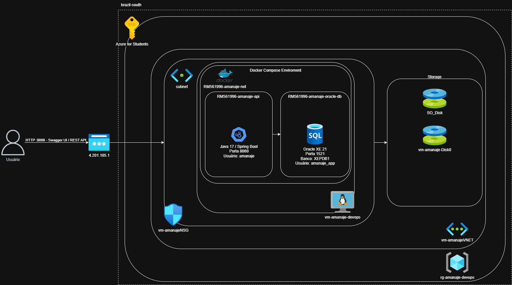

# Amanajé API — DevOps Tools & Cloud Computing

## Descrição do Projeto

O **Amanajé** é uma API REST desenvolvida em Java 17 com Spring Boot para monitoramento climático e ambiental de regiões vulneráveis.

A solução permite cadastrar e consultar clientes institucionais, regiões monitoradas, estações IoT, leituras ambientais, avaliações de risco, alertas e indicadores regionais.

Este projeto foi utilizado na entrega da disciplina **DevOps Tools & Cloud Computing**, com foco na conteinerização em nuvem da aplicação Java Advanced.

A aplicação é executada em uma Máquina Virtual Linux na Azure, utilizando Docker Compose para subir dois containers integrados:

* Container da API Java Spring Boot;
* Container do banco Oracle XE.

---

## Integrantes

| RM       | Nome                             |
| -------- | -------------------------------- |
| RM561408 | Gustavo Crevelari Monteiro Porto |
| RM561996 | Lucca de Araujo Gomes            |
| RM561671 | Rafaela Ferreira Santos          |
| RM566224 | Victor Sabelli Rocha Batista     |

---

## Benefícios para o Negócio

O Amanajé oferece uma base centralizada para monitoramento climático e ambiental de regiões vulneráveis, permitindo que instituições públicas, ONGs e organizações privadas acompanhem regiões de risco, estações IoT, leituras ambientais e alertas operacionais.

Principais benefícios:

* Centralização de dados ambientais;
* Cadastro de clientes, regiões e estações IoT;
* Registro de leituras ambientais;
* Apoio à identificação de riscos ambientais;
* Registro de alertas e recomendações operacionais;
* Ambiente padronizado com Docker;
* Execução reproduzível em nuvem;
* Separação entre aplicação e banco de dados;
* Persistência dos dados com volume nomeado;
* Base preparada para evolução futura com automação, CI/CD e observabilidade.

---

## Arquitetura



A arquitetura utiliza uma VM Linux na Azure executando Docker Compose. A API Java Spring Boot é exposta pela porta `8080` através do IP público da VM. O banco Oracle XE roda em um container separado, na mesma rede Docker da aplicação, com persistência em volume nomeado.

Fluxo macro:

```text
Usuário / Professor
        ↓ HTTP :8080
Azure Public IP
        ↓
Azure Linux VM - Ubuntu 22.04
        ↓
Docker Engine + Docker Compose
        ↓
Docker Network: RM561996-amanaje-net
        ↓
Container Java Spring Boot API
        ↓ JDBC
Container Oracle XE Database
        ↓
Docker Named Volume
```

---

## Tecnologias Utilizadas

* Java 17
* Spring Boot
* Maven
* Oracle XE
* Docker
* Docker Compose
* Azure Virtual Machine
* Azure CLI
* Swagger/OpenAPI
* GitHub

---

## Arquivos de DevOps

Os principais arquivos da entrega DevOps estão disponíveis no repositório:

* [Script Azure CLI](scripts/azure-vm.sh)
* [Docker Compose YAML](docker-compose.yml)
* [Dockerfile](Dockerfile)
* [Arquivo de variáveis de ambiente de exemplo](.env.example)
* [Imagem da Arquitetura](docs/images/devops-fluxograma.png)

O script Azure CLI cria a infraestrutura em nuvem, abre as portas necessárias e instala Docker, Docker Compose, Git e nano na VM.

O Docker Compose define a execução da API Java, do banco Oracle XE, da rede Docker e do volume nomeado.

---

## Containers da Solução

| Container                    | Função               | Porta  | Observação                                  |
| ---------------------------- | -------------------- | ------ | ------------------------------------------- |
| `RM561996-amanaje-api`       | API Java Spring Boot | `8080` | Imagem personalizada gerada pelo Dockerfile |
| `RM561996-amanaje-oracle-db` | Banco Oracle XE      | `1521` | Usa volume nomeado para persistência        |

---

## Rede e Volume Docker

Rede Docker:

```text
RM561996-amanaje-net
```

Volume nomeado:

```text
RM561996-amanaje-oracle-data
```

---

## Variáveis de Ambiente

O projeto utiliza um arquivo `.env` para configurar os containers.

O arquivo `.env` não deve ser versionado. O repositório possui o arquivo `.env.example`, usado como modelo.

Exemplo:

```env
REPRESENTANTE_RM=RM561996

ORACLE_SYS_PASSWORD=OracleSys123
AMANAJE_DB_USER=amanaje_app
AMANAJE_DB_PASSWORD=Amanaje123
```

Essas credenciais são usadas apenas pelo banco Oracle criado dentro do container Docker.

---

# How To — Execução da Solução em Nuvem

## 1. Criar a infraestrutura na Azure

Na máquina local, executar:

```bash
./scripts/azure-vm.sh
```

O script cria:

* Resource Group na Azure;
* VM Linux Ubuntu;
* Abertura da porta `22` para SSH;
* Abertura da porta `8080` para a API;
* Abertura da porta `1521` para o Oracle;
* Instalação de Docker;
* Instalação do Docker Compose plugin;
* Instalação de Git e nano.

Ao final, o script exibe o IP público da VM.

---

## 2. Acessar a VM

Substituir `<PUBLIC_IP>` pelo IP público exibido pelo script.

```bash
ssh amanajeadm@<PUBLIC_IP>
```

---

## 3. Clonar o repositório na VM

```bash
git clone https://github.com/gs-1-tdspo2/gs-devops-tools-cloud-computing.git
cd gs-devops-tools-cloud-computing
```

---

## 4. Criar o arquivo `.env`

```bash
cp .env.example .env
```

Conferir:

```bash
cat .env
```

---

## 5. Subir a aplicação e o banco

```bash
docker compose up -d --build
```

Esse comando executa os containers em background.

---

## 6. Verificar containers em execução

```bash
docker ps
```

Containers esperados:

```text
RM561996-amanaje-api
RM561996-amanaje-oracle-db
```

---

## 7. Exibir logs dos containers

Logs do banco:

```bash
docker compose logs oracle-db
```

Logs da aplicação:

```bash
docker compose logs amanaje-api
```

Os logs da aplicação devem indicar que a API iniciou com o perfil `oracle`, conectou ao Oracle e iniciou na porta `8080`.

---

## 8. Acessar a aplicação em nuvem

Swagger:

```text
http://<PUBLIC_IP>:8080/swagger-ui/index.html
```

Health check:

```text
http://<PUBLIC_IP>:8080/api/health
```

Dashboard summary:

```text
http://<PUBLIC_IP>:8080/api/dashboard/summary
```

---

# Demonstração de CRUD pelo Swagger

A demonstração dos cadastros deve ser feita pelo Swagger, para evidenciar que a API Java está recebendo requisições HTTP e persistindo no banco Oracle containerizado.

Acessar:

```text
http://<PUBLIC_IP>:8080/swagger-ui/index.html
```

Para cada endpoint:

1. Abrir o endpoint no Swagger;
2. Clicar em `Try it out`;
3. Inserir o JSON;
4. Clicar em `Execute`;
5. Conferir a resposta;
6. Guardar os IDs retornados.

---

## 1. Create — Criar Cliente

Endpoint:

```http
POST /api/clientes
```

JSON:

```json
{
  "nome": "Defesa Civil Municipal de Porto Alegre",
  "tipoCliente": "GOVERNO_DEFESA_CIVIL",
  "documento": "12345678000199",
  "emailContato": "defesacivil@portoalegre.rs.gov.br",
  "telefone": "5133334444"
}
```

Após executar, guardar o `idCliente`.

---

## 2. Create — Criar Região Monitorada

Endpoint:

```http
POST /api/regioes
```

Substituir `idCliente` pelo ID retornado no cadastro do cliente.

```json
{
  "idCliente": 1,
  "nome": "Região Ribeirinha Porto Alegre",
  "cidade": "Porto Alegre",
  "estado": "RS",
  "latitude": -30.0346,
  "longitude": -51.2177,
  "tipoArea": "REGIAO_RIBEIRINHA",
  "nivelVulnerabilidade": 8,
  "visibilidade": "INSTITUCIONAL"
}
```

Após executar, guardar o `idRegiao`.

---

## 3. Create — Criar Estação IoT

Endpoint:

```http
POST /api/estacoes
```

Substituir `idRegiao` pelo ID retornado no cadastro da região.

```json
{
  "idRegiao": 1,
  "codigoEstacao": "AMANAJE-RS-POA-001",
  "nome": "Estação Enchente Porto Alegre 001",
  "tipoEstacao": "SIMULADA",
  "status": "ATIVA",
  "latitude": -30.0346,
  "longitude": -51.2177
}
```

Após executar, guardar o `idEstacao`.

---

## 4. Read — Consultar Dados pelo Swagger

Consultar clientes:

```http
GET /api/clientes
```

Consultar regiões:

```http
GET /api/regioes
```

Consultar estações da região:

```http
GET /api/estacoes/regiao/1
```

Essas consultas demonstram que os dados criados pela API foram persistidos e podem ser recuperados pela própria aplicação em nuvem.

---

## 5. Update — Atualizar Cliente

Endpoint:

```http
PUT /api/clientes/{id}
```

Substituir `{id}` pelo ID do cliente criado.

JSON:

```json
{
  "nome": "Defesa Civil Municipal de Porto Alegre - Atualizada",
  "tipoCliente": "GOVERNO_DEFESA_CIVIL",
  "documento": "12345678000199",
  "emailContato": "defesacivil.atualizada@portoalegre.rs.gov.br",
  "telefone": "51999998888"
}
```

Validar novamente:

```http
GET /api/clientes
```

---

## 6. Delete — Excluir Cliente

Endpoint:

```http
DELETE /api/clientes/{id}
```

Substituir `{id}` pelo ID do cliente criado.

Validar novamente:

```http
GET /api/clientes
```

Caso a aplicação use exclusão lógica, o registro pode continuar existindo na resposta com status de inativo. Caso use exclusão física, o registro removido não aparecerá mais.

---

# Evidências com Docker Exec

## Container da aplicação

Verificar usuário conectado:

```bash
docker container exec -it RM561996-amanaje-api whoami
```

Resultado esperado:

```text
amanaje
```

Verificar diretório atual:

```bash
docker container exec -it RM561996-amanaje-api pwd
```

Resultado esperado:

```text
/app
```

Listar estrutura de diretórios:

```bash
docker container exec -it RM561996-amanaje-api ls -l
```

---

## Container do banco

Verificar usuário conectado:

```bash
docker container exec -it RM561996-amanaje-oracle-db whoami
```

Verificar diretório atual:

```bash
docker container exec -it RM561996-amanaje-oracle-db pwd
```

Listar estrutura de diretórios:

```bash
docker container exec -it RM561996-amanaje-oracle-db ls -l
```

---

# Evidência de Persistência pelo Swagger

O banco Oracle utiliza o volume nomeado:

```text
RM561996-amanaje-oracle-data
```

A persistência será demonstrada sem acessar SQL diretamente. A validação será feita pela API, usando o Swagger antes e depois da reinicialização dos containers.

## 1. Criar dados pelo Swagger

Executar pelo Swagger:

```http
POST /api/clientes
POST /api/regioes
POST /api/estacoes
```

Depois validar os dados:

```http
GET /api/clientes
GET /api/regioes
GET /api/estacoes/regiao/{idRegiao}
```

---

## 2. Parar os containers sem remover o volume

No terminal da VM:

```bash
docker compose down
```

---

## 3. Subir novamente os containers

```bash
docker compose up -d
```

Verificar que os containers voltaram:

```bash
docker ps
```

---

## 4. Validar novamente pelo Swagger

Acessar novamente:

```text
http://<PUBLIC_IP>:8080/swagger-ui/index.html
```

Executar:

```http
GET /api/clientes
GET /api/regioes
GET /api/estacoes/regiao/{idRegiao}
```

Se os dados criados antes do `docker compose down` continuarem aparecendo após o `docker compose up -d`, a persistência pelo volume nomeado foi demonstrada.

Não utilizar durante a demonstração:

```bash
docker compose down -v
```

Esse comando remove o volume e apaga os dados.

---

## Rotas Principais

| Método | Rota                              | Descrição                           |
| ------ | --------------------------------- | ----------------------------------- |
| GET    | `/api/health`                     | Verifica se a API está ativa        |
| GET    | `/api/dashboard/summary`          | Retorna o resumo geral do dashboard |
| GET    | `/api/clientes`                   | Lista clientes ativos               |
| POST   | `/api/clientes`                   | Cria cliente                        |
| PUT    | `/api/clientes/{id}`              | Atualiza cliente                    |
| DELETE | `/api/clientes/{id}`              | Exclui cliente                      |
| GET    | `/api/regioes`                    | Lista regiões monitoradas           |
| POST   | `/api/regioes`                    | Cria região monitorada              |
| GET    | `/api/estacoes/regiao/{idRegiao}` | Lista estações de uma região        |
| POST   | `/api/estacoes`                   | Cria estação IoT                    |

---

## Checklist de Evidências da Entrega

| Evidência                 | Comando ou local                                                                  |
| ------------------------- | --------------------------------------------------------------------------------- |
| Execução em background    | `docker compose up -d --build`                                                    |
| Containers rodando        | `docker ps`                                                                       |
| Logs do banco             | `docker compose logs oracle-db`                                                   |
| Logs da API               | `docker compose logs amanaje-api`                                                 |
| Swagger em nuvem          | `http://<PUBLIC_IP>:8080/swagger-ui/index.html`                                   |
| Create pelo Swagger       | `POST /api/clientes`, `POST /api/regioes`, `POST /api/estacoes`                   |
| Read pelo Swagger         | `GET /api/clientes`, `GET /api/regioes`, `GET /api/estacoes/regiao/{idRegiao}`    |
| Update pelo Swagger       | `PUT /api/clientes/{id}`                                                          |
| Delete pelo Swagger       | `DELETE /api/clientes/{id}`                                                       |
| Usuário da API            | `docker container exec -it RM561996-amanaje-api whoami`                           |
| Diretório da API          | `docker container exec -it RM561996-amanaje-api pwd`                              |
| Estrutura da API          | `docker container exec -it RM561996-amanaje-api ls -l`                            |
| Usuário do banco          | `docker container exec -it RM561996-amanaje-oracle-db whoami`                     |
| Diretório do banco        | `docker container exec -it RM561996-amanaje-oracle-db pwd`                        |
| Estrutura do banco        | `docker container exec -it RM561996-amanaje-oracle-db ls -l`                      |
| Persistência pelo Swagger | `docker compose down`, `docker compose up -d` e depois `GET` novamente no Swagger |

---

## Remoção dos Recursos Azure

Ao final da entrega, remover os recursos para evitar cobrança.

```bash
az group delete --name rg-amanaje-devops --yes
```

---

## Links da Entrega

Repositório GitHub:

[Amanajé API — DevOps Tools & Cloud Computing](https://github.com/gs-1-tdspo2/gs-devops-tools-cloud-computing)

Vídeo no YouTube:

[Adicionar link do vídeo demonstrativo]

---
